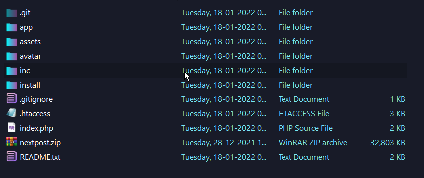
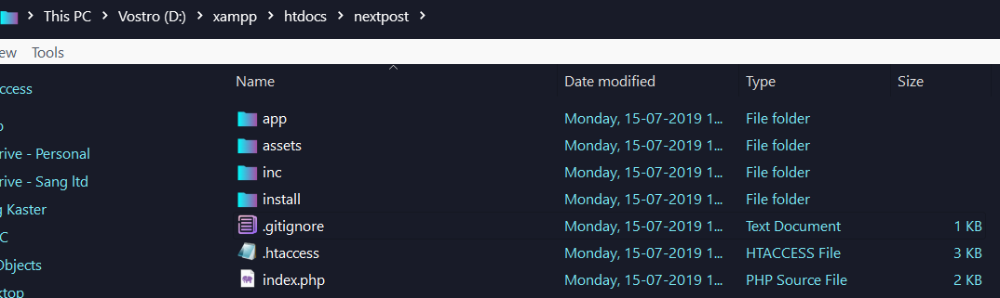
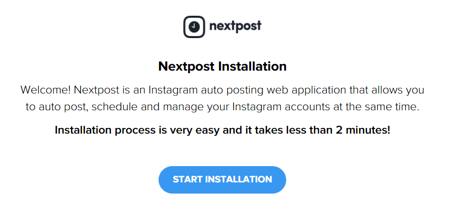
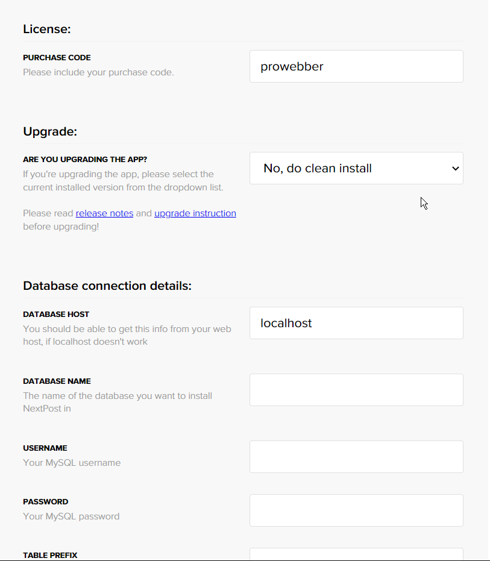
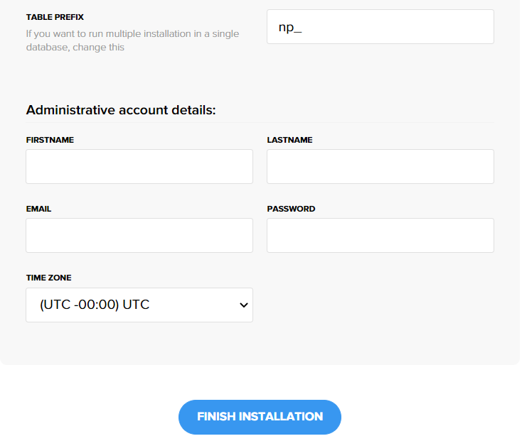
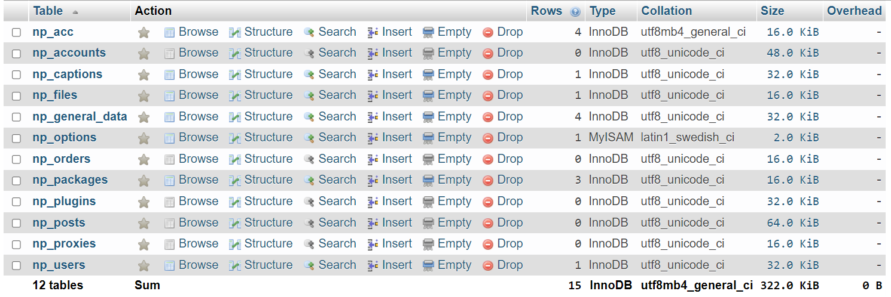
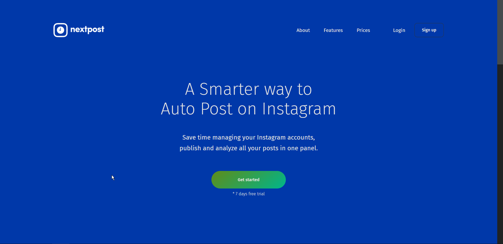
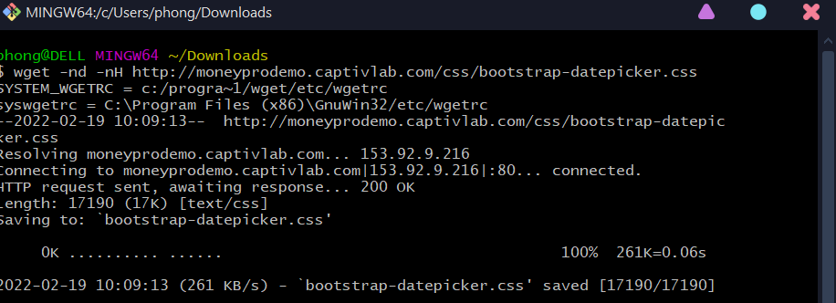
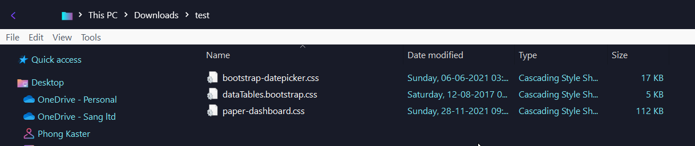

<h1 align="center">Standard Pure PHP Architecture 
    The fastest source code for building website in a short time !
</h1>

    

# [**Table Of Content**](#table-of-content)
- [**Table Of Content**](#table-of-content)
- [**Initialization**](#initialization)
- [**Installation**](#installation)
- [**Controller**](#controller)
- [**SQL**](#sql)
  - [**Informal Query**](#informal-query)
  - [**Formal Query**](#formal-query)
- [**Global Variable**](#global-variable)
- [**Copy A Front-end Website**](#copy-a-front-end-website)
- [**FAQ**](#faq)
  - [**1. Can't Press Ctrl + U or Right-Click with Mouse**](#1-cant-press-ctrl--u-or-right-click-with-mouse)
- [**Made with 💘 and PHP **](#made-with--and-php-)

# [**Initialization**](#initialization)

(1) Chọn Code -> Download ZIP để tải mã nguồn mở này về máy. Sau khi giải nén mã nguồn sẽ có hình như sau đây:

    

(2) Để sử dụng mã nguồn này hãy sao chép và dán tệp tin nén `nextpost.zip` vào thư mục cài đặt `xampp` và giải nén tệp tin này ra.

(3) Sau khi giải nén ra thì sẽ có dạng như sau: `nextpost` -> `nextpost` -> `source code` 

(4) chép `source code` ra thư mục `nextpost` gốc và xóa thư mục còn lại đi. Lúc này thư mục sẽ còn dạng: `nextpost` -> `source code` như hình dưới đây:

    

Đổi tên nextpost thành bất cứ tên dự án nào theo mong muốn

# [**Installation**](#installation)

(1) Khởi động XAMPP và bật dịch vụ Apache và MySQL lên

(2) Vào đường dẫn http://localhost/nextpost (nếu tên nextpost vẫn được giữ nguyên) sẽ có màn hình như sau:

    

(3) Chọn **START INSTALLATION** và chọn *I read and accept the agreement !*, nhấn NEXT cho tới khi hiện ra màn hình sau:

    

- **DATABASE NAME**: tên cơ sở dữ liệu trong phpmyadmin. Giả sử ta muốn kết nối với cơ sở dữ liệu tên `Forever21` thì việc đầu tiên cần làm
là vào phpmyadmin, tạo một cơ sở dữ liệu tên `Forever21` sau đó chép tên cơ sở dữ liệu này và dán vào ô Database Name 

- **USERNAME**: tên tài khoản đăng nhập vào cơ sở dữ liệu trên. Theo mặc định là `root`.

- **PASSWORD**: mật khẩu đăng nhập vào cơ sở dữ liệu trên. Theo mặc định là để trống.

    

- **TABLE PREFIX**: tên tiền tố của các bảng. Giả sử ta đặt là np_ thì mọi bảng trong cơ sở dữ liệu sẽ có tên như sau đây:

    

- **ADMINISTRATIVE ACCOUNT DETAIL** là những thông tin cơ bản để tạo tài khoản quản trị viên. Tài khoản này sẽ dùng để đăng nhập vào hệ thống này sau khi quá trình cài đặt thành công.

(4) Qúa trình kết thúc và một màn hình thông báo hiện lên

    

Tuy nhiên, khi ấn login thì sẽ cố lỗi xảy ra dẫn tới không vào được trang chủ. Lỗi này là do bảng **TABLE_OPTIONS** không được đặt tên theo đúng quy tắc.
Để sửa lỗi này, mở phpMyAdmin và chọn vào tên cơ sở dữ liệu đã ghi ở bước trước đó. Chọn mục **SQL** ở thanh điều hướng phía trên và ghi câu lệnh sau:

    ALTER TABLE TABLE_OPTIONS RENAME TO NP_OPTIONS

Và sau khi bảng này đã hoàn thiện thì có thể đăng nhập bình thường 

    

Sau khi quá trình cài đặt hoàn tất, ta có thể xóa bỏ hoàn toàn thư mục **Install** đi vì không còn giá trị sử dụng nữa !

# [**Controller**](#controller)

Dưới đây là những controller quan trọng có lẽ không nên xóa đi

**CHANGE PASSWORD**: thay đổi mật khẩu

**CRON**: cào dữ liệu từ các trang khác

**INDEX**: xử lý ở trang chủ

**LOGIN**: đăng nhập

**LOGOUT**: đăng xuất

**PASSWORD RESET**: khôi phục mật khẩu

**PROFILE**: xử lý thông tin cá nhân khi đăng nhập 

**RECOVERY**: khôi phục tài khoản

**SETTING**: cài đặt trang 

**SIGN UP**: đăng kí mới tài khoản

**USERS**: quản lý người dùng
 
# [**SQL**](#sql)

Có 2 cách truy vấn trong dự án này được sử dụng: truy vấn thuần & truy vấn theo cú pháp quy ước.

## [**Informal Query**](#informal-query)

Dưới đây là cách viết truy thuần có thể sử dụng trong dự án này.

    //code...
    $query = DB::query("select count(*) as aggregate 
                        from (select '1' as `row_count` 
                              from `".TABLE_PREFIX.TABLE_TRANSACTIONS."` 
                              where `type` = ' ".$type." ' 
                              and `user_id` = ".$AuthUser->get("id")." ) 
                              count_row_table");
                              
    $result = $query->get();
    $totalRecord = $result[0]->aggregate;

Câu truy vấn phía trên giúp chúng ta đếm xem có bao nhiêu bản ghi trong bảng `TABLE_TRANSACTIONS` với điều kiện `type` & `user_id` tương ứng.

Hoặc thêm một ví dụ khác như sau 

    $month = date('m');
    $year = date('Y');
    $today = date('Y-m-d');
    $sevendayago = date('Y-m-d', strtotime($today. ' - 7 days')); 

    // query to get sum(amount) in a month
    $queryMonth = DB::query("select SUM(AMOUNT) as aggregate
    from `".TABLE_PREFIX.TABLE_TRANSACTIONS."` 
    where `user_id` = '".$AuthUser->get("id")."' 
    and `type` = '".$type."' 
    and `transactiondate` between '".$year."-".$month."-01' and '".$today."'");

    $result = $queryMonth->get();
    $resp->month = $result[0]->aggregate;

Câu truy vấn này giúp chúng ta truy vấn xem tổng số tiền giao dịch của bảng `TABLE_TRANSACTIONS` với điều kiện `user_id`, `type` và `transactiondate` tương ứng.

Kết quả của các câu truy vấn này được trả về dưới dạng mảng. Nên nếu lấy ta phải chỉ định rõ như sau

Đối với ví dụ thứ nhất: 

    $totalRecord = $result[0]->aggregate;

Đối với ví dụ thứ hai: 

    $resp->month = $result[0]->aggregate;

## [**Formal Query**](#formal-query)

Đối với cách viết quy ước thì hướng dẫn viết tại [đây](https://github.com/usmanhalalit/pixie?fbclid=IwAR1raGRcZXsvxxMRvZBq74WPTbIRhc9XJdR8P_PTVA1DJvanCAlaenU3ATA)

Dưới đây là ví dụ cho cách viết này: 

Câu truy vấn(1):

    $query = DB::table(TABLE_PREFIX.TABLE_ACCOUNTS)
                ->where("user_id", $AuthUser->get("id"))
                ->select([
                    "name","balance"
                ]);

Câu truy vấn (1) sẽ trả về `name` và `balance` theo `user_id` của bảng `TABLE_ACCOUNTS`

Câu truy vấn(2):

    $query = DB::table(TABLE_PREFIX.TABLE_CATEGORIES)
                    ->where(TABLE_PREFIX.TABLE_CATEGORIES.".user_id", "=", $AuthUser->get("id"))
                    ->where(TABLE_PREFIX.TABLE_CATEGORIES.".type" , "=", $type)
                    ->leftJoin(TABLE_PREFIX.TABLE_TRANSACTIONS,
                        TABLE_PREFIX.TABLE_TRANSACTIONS.".category_id",
                        "=",
                        TABLE_PREFIX.TABLE_CATEGORIES.".id")
                    ->select([
                        TABLE_PREFIX.TABLE_CATEGORIES.".*",
                        DB::raw("sum(".TABLE_PREFIX.TABLE_TRANSACTIONS.".amount) as totalAmount" )
                    ])
                    ->groupBy(TABLE_PREFIX.TABLE_CATEGORIES.".name");

Câu truy vấn(2) sẽ trả về tất cả các cột của `TABLE_CATEGORIES` và cột `totalAmount` - tổng của tất cả giao dịch theo từng tên danh mục(TABLE_CATEGORIES."name")

Câu truy vấn(3):

    $date = new \Moment\Moment("now", date_default_timezone_get());
    // for income
    $query = DB::table(TABLE_PREFIX.TABLE_TRANSACTIONS)
                    ->select(DB::raw("sum(amount) as total, month(transactiondate) as month"))
                    ->where("user_id", "=", $AuthUser->get("id"))
                    ->where("type", "=", 1)
                    ->whereBetween("transactiondate", $date->startOf('year')->format("Y-m-d"), $date->endOf('year')->format("Y-m-d"))
                    ->groupBy("month")
                    ->orderBy("month");

Câu truy vấn(3) trả về cột `month` và `total` - tổng giá trị của giao dịch theo từng tháng

> Note: Tất cả các câu truy vấn này được trả về dưới dạng mảng. 

Ta sẽ lấy dữ liệu và truyền vào mảng data như sau:

    foreach( $result as $r )
    {
        $data[] = array(
            "id" => $r->id,
            "name" => $r->name,
            "amount" => isset($r->totalAmount) ? (double)$c->totalAmount : 0,
            "..." => $r->...,
            "..." => $r->...
        );
    }

# [**Global Variable**](#global-variable)

Những biến toàn cục cần nằm trong thư mục **app->config->config.php** là những biến có giá trị sử dụng trong toàn bộ chương trình này !

- **APPURL**     : D:\xampp\htdocs\Cellphone-Shop/app

- **THEME_PATH** : D:\xampp\htdocs\Cellphone-Shop/app/inc/themes

- **THEME_URL**  : D:\xampp\htdocs\Cellphone-Shop/inc/themes

- **ROOTPATH**   : D:\xampp\htdocs\Cellphone-Shop

- **APPPATH**    : D:\xampp\htdocs\Cellphone-Shop\app

# [**Copy A Front-end Website**](#copy-a-front-end-website)

Để sao chép được các tệp tin HTML, CSS và JavaScript của một webstite nào đó. Chúng ta sử dụng [wget](#) để thực hiện. 

Hướng dẫn chi tiết sử dụng `wget` tại [đây](https://www.jcchouinard.com/wget/).

Ví dụ minh họa, có 3 tệp tin CSS ở 3 đường dẫn phía dưới như sau:

    http://moneyprodemo.captivlab.com/css/bootstrap-datepicker.css
    http://moneyprodemo.captivlab.com/css/paper-dashboard.css
    http://moneyprodemo.captivlab.com/plugin/datatables/css/dataTables.bootstrap.css

Để tải 3 tệp tin này về sẽ sử dụng 3 câu lệnh sau:

    wget -nd -nH http://moneyprodemo.captivlab.com/css/bootstrap-datepicker.css
    wget -nd -nH http://moneyprodemo.captivlab.com/css/paper-dashboard.css
    wget -nd -nH http://moneyprodemo.captivlab.com/plugin/datatables/css/dataTables.bootstrap.css

Và mở `cmd`, `powershell` hoặc `gitbash`. Chép 3 lệnh phía trên nhấn Enter:

Và kết quả sẽ như hình phía dưới:

    

Bằng cách này, chúng ta có thể download tất cả các tệp tin cần thiết của một webstite.

# [**FAQ**](#fag)
## [**1. Can't Press Ctrl + U or Right-Click with Mouse**](#1-cant-press-ctrl--u-or-right-click-with-mouse)

Khi nhấn tổ hợp phím `Ctrl + U` hoặc bất kì tổ hợp nào mà màn Google Developer Tool không hiện ra. Thì nguyên nhân là do trong javascript của webstite đó đang chứa một đoạn code có dạng như sau:

    document.onkeydown = function(e) 
    {
		if(e.keyCode == 123) 
		{
			return false;
		}
		
		if(e.ctrlKey && e.shiftKey && e.keyCode == 'I'.charCodeAt(0))
		{
			return false;
		}
		
		if(e.ctrlKey && e.shiftKey && e.keyCode == 'J'.charCodeAt(0))
		{
			return false;
		}
		
		if(e.ctrlKey && e.keyCode == 'U'.charCodeAt(0))
		{
			return false;
		}
	
		if(e.ctrlKey && e.shiftKey && e.keyCode == 'C'.charCodeAt(0))
		{
			return false;
		}      
	};

Hoặc vô hiệu hóa mọi thao tác trên màn hình website với đoạn chương trình sau:

	$("html").on("contextmenu",function()
    {
	 	return false;
	});

Có 2 cách có thể khắc phục được việc bị chặn các nút thao tác trên website đó như sau:

**Cách 1**: Hãy F5 làm mới website và nhanh tay ấn `Ctrl + U` trước khi website hiện thị đầy đủ.

**Cách 2**: Trên thanh tìm kiếm Google, sử dụng cú pháp `view-source:<đường dẫn mong muốn>` để xem trang trực tiếp HTML luôn.

Ví dụ: để xem trang shop-load-more.html nhưng trang này bị khóa các tổ hợp phím hoặc chuột phải

    view-source:https://bestwebcreator.com/shopwise/demo/shop-load-more.html

# [**Made with 💘 and PHP **](#made-with-love-and-php)