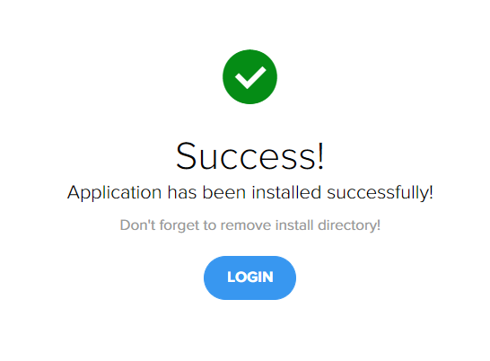

<h1 align="center">Standard Pure PHP Architecture 
    The fastest source code for building website in a short time !
</h1>

    

# [**Table Of Content**](#table-of-content)
- [**Table Of Content**](#table-of-content)
- [**Initialization**](#initialization)
- [**Installation**](#installation)
- [**Controller**](#controller)
- [**Features**](#features)
- [**Post Script**](#post-script)
- [**Made with 💘 and PHP **](#made-with--and-php-)

# [**Initialization**](#initialization)

(1) Chọn Code -> Download ZIP để tải mã nguồn mở này về máy. Sau khi giải nén mã nguồn sẽ có hình như sau đây:

    

(2) Để sử dụng mã nguồn này hãy sao chép và dán tệp tin nén `nextpost.zip` vào thư mục cài đặt `xampp` và giải nén tệp tin này ra.

(3) Sau khi giải nén ra thì sẽ có dạng như sau: `nextpost` -> `nextpost` -> `source code` 

(4) chép `source code` ra thư mục `nextpost` gốc và xóa thư mục còn lại đi. Lúc này thư mục sẽ còn dạng: `nextpost` -> `source code` như hình dưới đây:

    

Đổi tên nextpost thành bất cứ tên dự án nào theo mong muốn

# [**Installation**](#installation)

(1) Khởi động XAMPP và bật dịch vụ Apache và MySQL lên

(2) Vào đường dẫn http://localhost/nextpost (nếu tên nextpost vẫn được giữ nguyên) sẽ có màn hình như sau:

    

(3) Chọn **START INSTALLATION** và chọn *I read and accept the agreement !*, nhấn NEXT cho tới khi hiện ra màn hình sau:

    

- **DATABASE NAME**: tên cơ sở dữ liệu trong phpmyadmin. Giả sử ta muốn kết nối với cơ sở dữ liệu tên `Forever21` thì việc đầu tiên cần làm
là vào phpmyadmin, tạo một cơ sở dữ liệu tên `Forever21` sau đó chép tên cơ sở dữ liệu này và dán vào ô Database Name 

- **USERNAME**: tên tài khoản đăng nhập vào cơ sở dữ liệu trên. Theo mặc định là `root`.

- **PASSWORD**: mật khẩu đăng nhập vào cơ sở dữ liệu trên. Theo mặc định là để trống.

    

- **TABLE PREFIX**: tên tiền tố của các bảng. Giả sử ta đặt là np_ thì mọi bảng trong cơ sở dữ liệu sẽ có tên như sau đây:

    

- **ADMINISTRATIVE ACCOUNT DETAIL** là những thông tin cơ bản để tạo tài khoản quản trị viên. Tài khoản này sẽ dùng để đăng nhập vào hệ thống này sau khi quá trình cài đặt thành công.

(4) Qúa trình kết thúc và một màn hình thông báo hiện lên

    

Tuy nhiên, khi ấn login thì sẽ cố lỗi xảy ra dẫn tới không vào được trang chủ. Lỗi này là do bảng **TABLE_OPTIONS** không được đặt tên theo đúng quy tắc.
Để sửa lỗi này, mở phpMyAdmin và chọn vào tên cơ sở dữ liệu đã ghi ở bước trước đó. Chọn mục **SQL** ở thanh điều hướng phía trên và ghi câu lệnh sau:

    ALTER TABLE TABLE_OPTIONS RENAME TO NP_OPTIONS

Và sau khi bảng này đã hoàn thiện thì có thể đăng nhập bình thường 

    

# [**Controller**](#controller)

Dưới đây là những controller quan trọng có lẽ không nên xóa đi

# [**Features**](#features)
So she was considering in her own mind (as well as she could, for the hot day made her feel very sleepy and stupid), whether the pleasure of making a daisy-chain would be worth the trouble of getting up and picking the daisies, when suddenly a White Rabbit with pink eyes ran close by her.
# [**Post Script**](#post-script)
There was nothing so very remarkable in that; nor did Alice think it so very much out of the way to hear the Rabbit say to itself, “Oh dear! Oh dear! I shall be late!” (when she thought it over afterwards, it occurred to her that she ought to have wondered at this, but at the time it all seemed quite natural); but when the Rabbit actually took a watch out of its waistcoat-pocket, and looked at it, and then hurried on, Alice started to her feet, for it flashed across her mind that she had never before seen a rabbit with either a waistcoat-pocket, or a watch to take out of it, and burning with curiosity, she ran across the field after it, and fortunately was just in time to see it pop down a large rabbit-hole under the hedge.
 
# [**Made with 💘 and PHP **](#made-with-love-and-php)